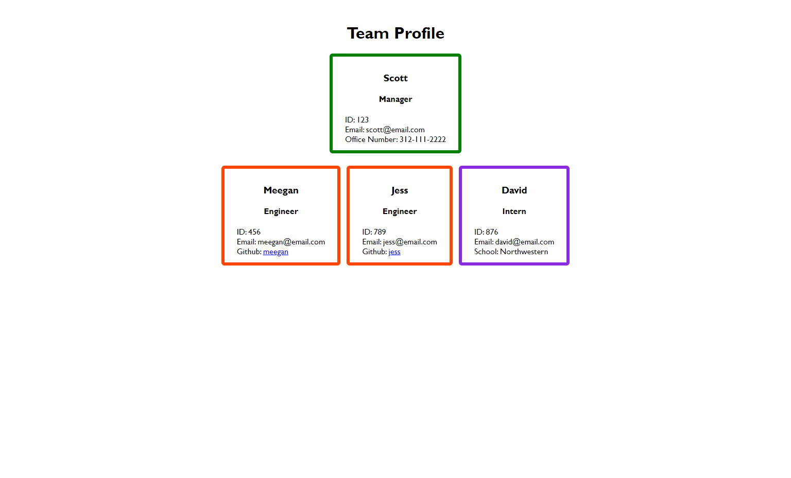

# TEAM PROFILE GENERATOR
  

  # Description 
  This project generates HTML pages to display team member information based on user input from the terminal
  # Table of Contents 
  * [Installation](#installation)
  * [Usage](#usage)
  * [License](#license)
  * [Contributing](#contributing)
  * [Tests](#tests)
  * [Questions](#questions)
  # Installation 
  Run via the terminal using node index commmand and follow prompts
  # Usage 
  Answer each prompt and select finish when all team members have been added
   # License
This application is covered under the MIT license
  # Contributing 
  William George Thomas in collaboration with classmates 
  # Tests 
  4 tests to check each team role
  # Questions 
  For further information:
 
  * GitHub:
    * [https://github.com/WilliamGeorgeThomas](https://github.com/WilliamGeorgeThomas)
 
  * Email:
    * williamgeorgethomas@gmail.com

# Demo

[Link to demo video](https://drive.google.com/file/d/1JVNKMwMEffE43JsMvzsBKbnIDeL-lq3G/view)

# Screenshot

